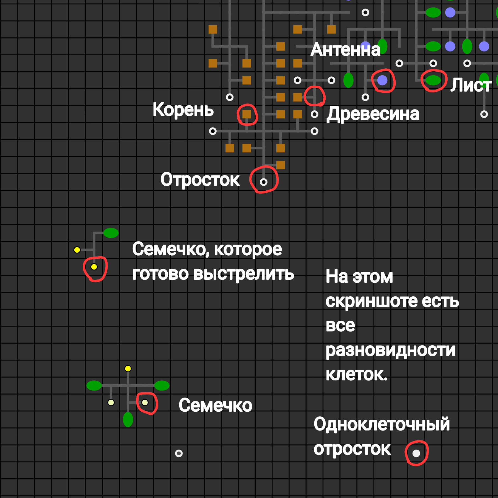
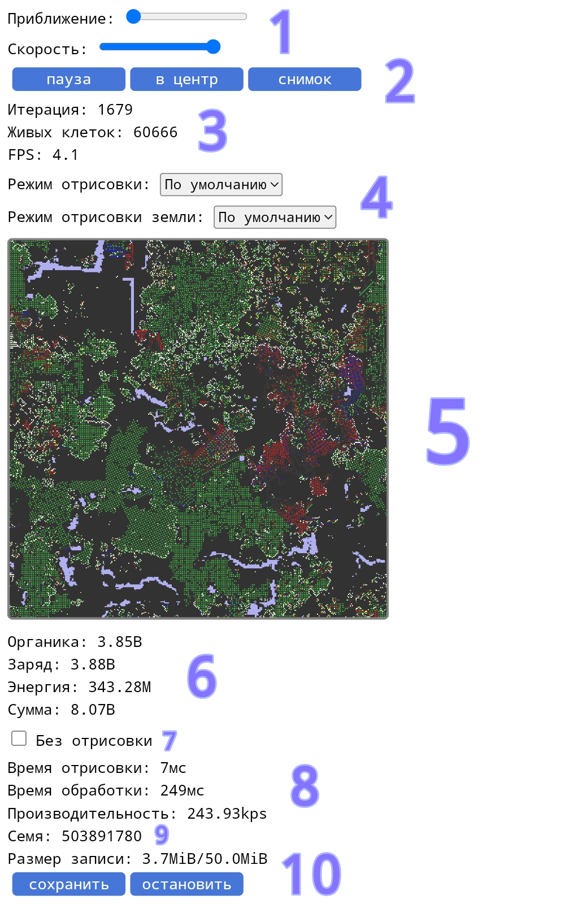

<h1 align="center">🦠 Искуственная Жизнь (ALife) 🍀</h1>

**[English 🇺🇸](README.md) | Русский 🇷🇺**

Искуственная жизнь: симуляция эволюции.

Идея основана на проекте «Борьба Кланов» от [foo52ru](https://youtube.com/@foo52ru).

Версия: 1.5.5 (21.03.2024)

[**ДЕМОВЕРСИЯ**](https://megospc.github.io/ALife/demo.html?lang=ru)\
[**ПОЛНАЯ ВЕРСИЯ**](https://megospc.github.io/ALife/index.html?lang=ru)

## Скриншоты

  
<b>Открой меня!</b>

  

## Особенности
+ Работает прямо в браузере: **не нужно ничего скачивать**, перейдите по [ссылке](https://megospc.github.io/ALife/index.html?lang=ru), чтобы начать.
+ Обрабатывает миры размером до **1800x1800 тайлов**.
+ Использование WebGL переносит отрисовку на видеокарту: **ускорение в 10 раз**!
+ Буфер памяти выделяется при запуске симуляции, поэтому сборщик мусора JavaScript не нагружается. Это **ускоряет обработку в 2 раза**.
+ Работает на мобильных устройствах.

## Описание
**ALife** симулирует эволюцию многоклеточных организмов.

### Принцип Работы
Поле симуляции состоит из множества квадратиков (далее «*Тайлы*»). В каждом *тайле* содержится некоторое количество ресурсов: *органики* и *заряда*. Также на тайле может находиться живая клетка (далее «*Клетка*»). Каждая *клетка* имеет свой запас энергии и немного потребляет каждый ход. Если энергии не хватает, клетка погибает. Когда клетка погибает, в зоне 3x3 **тайла** остаётся *органика* и *заряд* (кол-во заряда = энергия, которая была в клетке). Если *органики* или *заряда* слишком много, тайл становится *отравленным*. Клетка погибает, если стоит на *отравленном тайле*.

Клетки бывают разного типа (далее «*Разновидности*»):
+ **Лист**. Каждый ход получает энергию от солнца. Чем больше *органики* в *тайле* под листом, тем больше энергии он получает. Если два листа соприкасаются, оба перестают производить энергию.
+ **Корень**. Преобразует *органику* в энергию. Не погибает на *органическом отравлении*.
+ **Антенна**. Собирает *заряд*. Не погибает на *энергетическом отравлении*.
+ **Отросток**. Каждый отросток имеет свой *геном*. Выполняя команды *генома*, отросток может создать вокруг себя новые *клетки*, сам он превратится в древесину. Цвет отростка зависит от количества энергии, которую он имеет (чёрный - мало, белый - много). Если отросток накопит 50 тыс. энергии, он отвалится от древесины, к которой прикреплён, и станет одноклеточным. Одноклеточный отросток может двигаться по полю и есть органику, пока не дал ответвления.
+ **Древесина**. Занимается транспортировкой энергии от производящих клеток к отросткам. 
+ **Семечко**. Заснувший отросток. Если древесина, к которой прикреплено семечко, погибает, семечко просыпается и превращается в отросток, который продолжит выполнять команды *генома*. Иногда перед пробуждением оно выстреливает и пролетает некоторое количество *тайлов*. Если такое семечко столкнётся с другой *клеткой*, все погибнут. Также семечко отвалится и проснётся, если накопит 30 тыс. энергии.

<table>
  <thead>
    <th>Разновидность</th>
    <th>Потребление</th>
  </thead>
  <tbody>
    <tr>
      <th>Лист</th>
      <td>10</td>
    </tr>
    <tr>
      <th>Корень</th>
      <td>10</td>
    </tr>
    <tr>
      <th>Антенна</th>
      <td>10</td>
    </tr>
    <tr>
      <th>Древесина</th>
      <td>10</td>
    </tr>
    <tr>
      <th>Отросток</th>
      <td>50</td>
    </tr>
    <tr>
      <th>Семечко</th>
      <td>5</td>
    </tr>
  </tbody>
</table>

### Главная Страница
На [главной странице](https://megospc.github.io/ALife/index.html?lang=ru), вы увидите настройки мира:
+ **Семя**. Число, из которого создаётся мир. Миры с одинаковыми настройками и семенами дадут одинаковый результат.
+ **Размер поля**. Размер мира в *тайлах*.
+ **Уровень солнца**. Чем больше уровень солнца, тем больше листья получают энергии.
+ **Изначальная плотность**. Плотность расположения первых отростков. 1/9 - значит, что на каждом девятом *тайле* будет расположен отросток. 1/6 - на каждом шестом, 1/50 - на каждом пятидесятом и т. д.
+ **Органика, заряд**. Кол-во органики и заряда, которое изначально будет в каждом тайле.
+ **Настройки записи**.
  + **Запись**. Если отмечен, симуляция будет записываться. 
  + **Интервал записи кадров**. Интервал между сохраняемыми кадрами симуляции. 5 - значит, что сохраняться будет каждый пятый кадр. 10 - каждый десятый, 50 - каждый пятидесятый и т. д.
  + **Макс. размер**. Максимальный размер записи в мегабайтах (MiB). Симуляция будет приостановлена, если запись достигнет его (при этом новый макс. размер увеличится в 2 раза).

Нажмите кнопку «Запуск», чтобы запустить симуляцию.

1. Рычажки, которые регулируют приближение камеры и скорость симуляции.
2. «Пауза/продолжить» приостанавливает/возобнавляет симуляцию. «В центр» сбрасывает приближение и положение камеры. «Снимок» сохраняет снимок мира. 
3. «Итерация» - номер кадра. «Живых клеток» - текущее кол-во живых клеток. «FPS» - среднее кол-во кадров за секунду. Нажмите, чтобы изменить целевой FPS.
4. Управление режимом отрисовки. «Режим отрисовки» для клеток и «Режим отрисовки земли» для тайлов.
5. Показывает, что происходит в мире. Зажмите и подвигайте мышью, чтобы изменить положение камеры. Кликните по тайлу, чтобы выбрать его.
6. Счётчики энергии в мире. «Органика» - кол-во энергии в виде органики. «Заряд» - кол-во заряда. «Энергия» - суммарное кол-во энергии в живых клетках. «Сумма» - сумма всех счётчиков.
7. Если отмечен, отрисовка выключается. 
8. Производительность. «Время отрисовки» - время, которое затрачено на отрисовку текущего кадра. «Время обработки» - на обработку. «Производительность» - среднее кол-во живых клеток, которое может быть обработано за секунду.
9. Семя симуляции.
10. Сохраняет симуляцию как файл. Чтобы открыть её, нажмите кнопку «Импорт» в настройках симуляции.
11. Управление записью. «Сохранить» - сохраняет запись. «Остановить» - останавливает запись.

### Песочница
Песочница запускает развитие одного вида отдельно. Чтобы перейти в песочницу, выберите тайл с отростоком или семечком и нажмите кнопку «Сохранить». Песочница откроется в новой вкладке, в неё будет загружен геном выбранного отростка (семечка).

Нажмите кнопку «Скачать», чтобы сохранить вид как файл. Чтобы открыть вид, перейдите по ссылке «Песочница» на главной странице. 

### Чтение записи
Чтобы открыть запись, перейдите по ссылке «Чтение записи» на главной странице.