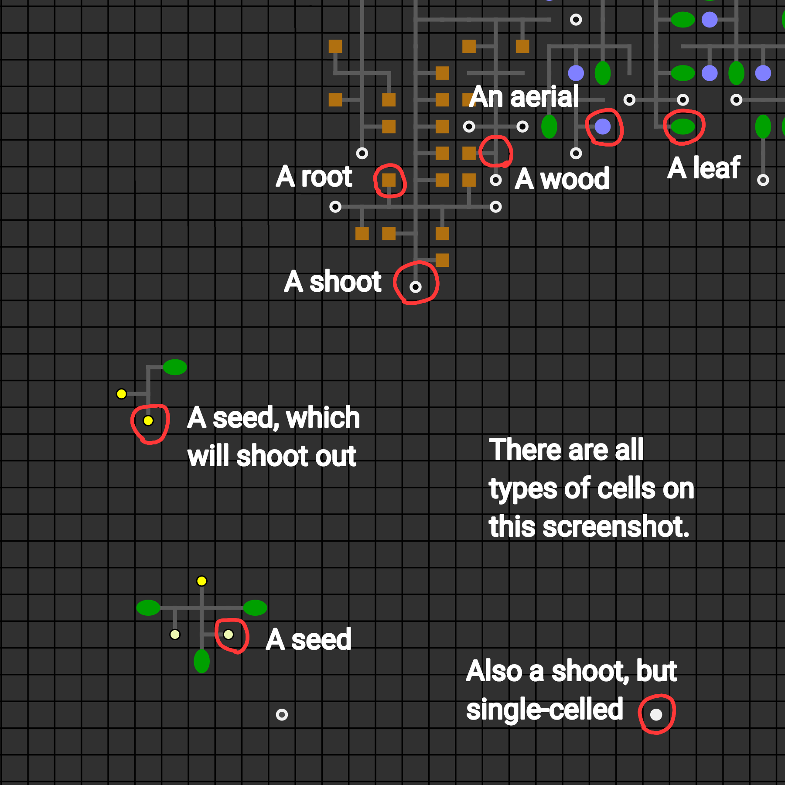

<h1 align="center">🦠 Artifical Life (ALife) 🍀</h1>

**English 🇺🇸 | [Русский](README-RU.md) 🇷🇺**

Artifical life: simulation of evolution.

Idea is taken from the project "The Battle Of Clans" by [Simulife Hub](https://youtube.com/@wallcraft-video).

Version: 1.5.5 (21.03.2024)

[**DEMOVERSION**](https://megospc.github.io/ALife/demo.html?lang=en)\
[**FULL VERSION**](https://megospc.github.io/ALife/index.html?lang=en)

## Screenshots

  
<b>Open me!</b>

  

## Features
+ It works right in a browser: **you don't need to download anything**, just go by [the link](https://megospc.github.io/ALife/index.html?lang=en).
+ You can run worlds up to **1800x1800 tiles** in size.
+ It renders on GPU using WebGL, so **it's 10x faster**!
+ A required memory buffer allocates when a simulation starts, so JavaScript's garbage cleaner isn't busy. **Processing is 2x faster**.
+ It works on mobile devices.

## Description
**ALife** simulates evolution of multicellular organisms.

### Operating Principle
The simulation field consists of many squares (a "*Tile*"). Each *tile* contains a some amount of resources: *organic* and *charge*. There may also be a living cell on the tile (a "*Cell*"). Each *cell* has its own energy reserve and consumes a little each turn. If there isn't enough energy, the cell dies. When a cell dies, *organic* and *charge* remain in the 3x3 **tiles** area (amount of charge = energy that was in the cell). If there is too much *organic* or *charge* in a tile, it becomes *poisoned*. The cell dies if its *tile* is *poisoned*.

Cells can be different types:
+ **Leaf**. Each turn gets energy from the sun. The more *organic* there is in a *tile* under a leaf, the more energy it can get. If two leaves touch, both stop producing energy.
+ **Root**. Converts *organic* into energy. Doesn't die on *organic poisoning*.
+ **Aerial**. Collects *charge*. Doesn't die on *energy poisoning*.
+ **Shoot**. Each shoot has its own *genome*. Following the commands of the *genome*, the shoot can create new *cells* around itself, turning into wood, eat any *cell* nearby (except wood), etc. The color of the shoot depends on the amount of energy it has (black - little, white - a lot). If the shoot accumulates 50K energy, it falls off the wood to which it is attached and become single-celled. A single-celled shoot can move around the field and eat organic.
+ **Wood**. Transports energy from producing cells to shoots.
+ **Seed**. A dormant shoot. If the wood to which the seed is attached dies, the seed wakes up and turns into a shoot that will continue to follow the commands of the *genome*. Sometimes, before waking up, a seed shoots out and flies through some number of *tiles*. If the such a seed collides with another *cell*, both die. Also, the seed will fall off and wake up if it accumulates 30K energy.

<table>
  <thead>
    <th>Type</th>
    <th>Consumption</th>
  </thead>
  <tbody>
    <tr>
      <th>Leaf</th>
      <td>10</td>
    </tr>
    <tr>
      <th>Root</th>
      <td>10</td>
    </tr>
    <tr>
      <th>Aerial</th>
      <td>10</td>
    </tr>
    <tr>
      <th>Wood</th>
      <td>10</td>
    </tr>
    <tr>
      <th>Shoot</th>
      <td>50</td>
    </tr>
    <tr>
      <th>Seed</th>
      <td>5</td>
    </tr>
  </tbody>
</table>

### Home Page
On the [home page](https://megospc.github.io/ALife/index.html?lang=en), you see the simulation settings:
+ **Seed**. The number from which the simulation will be created. Simulations with the same settings and seeds will give the same result.
+ **Field size**. The size of the simulation in *tiles*.
+ **Sun level**. The higher the sun level, the more energy leaves can get.
+ **Initial density**. Density of location of the first shoots. 1/9 - means that on every ninth *tile* (on the average) will be a shoot. 1/6 - on every sixth, 1/50 - on every fiftieth, etc.
+ **Organic, charge**. The amount of organic and charge that will be in each tile when the simulation will start.

Once you have configured the parameters, click the "Start" button.

1. Levers that control camera zoom and simulation speed.
2. "Pause/Resume" pauses/resumes the simulation. "To Center" resets camera position and zoom. "Snapshot" saves a snapshot of the world.
3. "Iteration" - iteration number. "Cells alive" - the current number of alive cells. "FPS" - the average number of frames per second, click to change the goal FPS.
4. Rendering mode control. "Rendering mode" for cells and "Backgound rendering mode" for tiles.
5. Shows what is happening in the world. Hold and move the mouse to change the camera position. Click on a tile to select it.
6. Counters of energy in the world. "Organic" - the amount of energy in organic form. "Charge" - amount of charge. "Energy" - amount of energy in living cells. "Total" - the sum of all counters.
7. If checked, rendering is disabled.
8. Productivity. "Rendering time" - the time spent rendering the current frame. "Processing time" - the time spent processing the current frame. "Productivity" - the average number of living cells that can be processed per second.
9. Simulation seed.
10. Saves simulation as a file. To open it, click the "Import" button in simulation settings.
11. Recording control. "Save" - saves the recording. "Stop" - stops recording.

### Sandbox
The sandbox shows the development of one species separately. To go to the sandbox, select a tile with a shoot or a seed and click the "Save" button. The sandbox will open in a new tab. The genome of the selected shoot (seed) will be loaded into it.

Click the "Download" button to save the species as a file. To open the species, follow the "Sandbox" link on the home page.

### Recording reader
To open a recording, follow the "Recording reader" link on the home page.

*If someting isn't clear enough, please, write about it in Issues.*