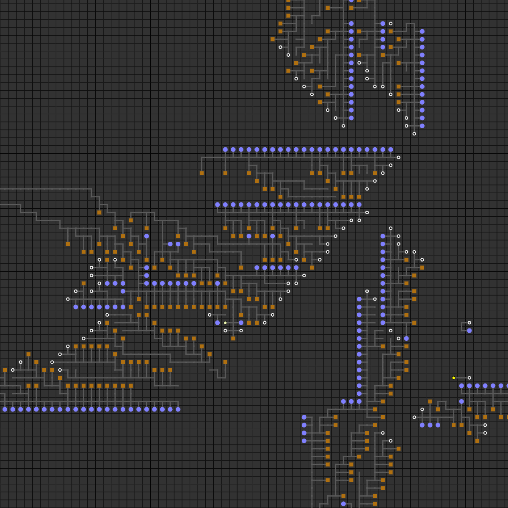
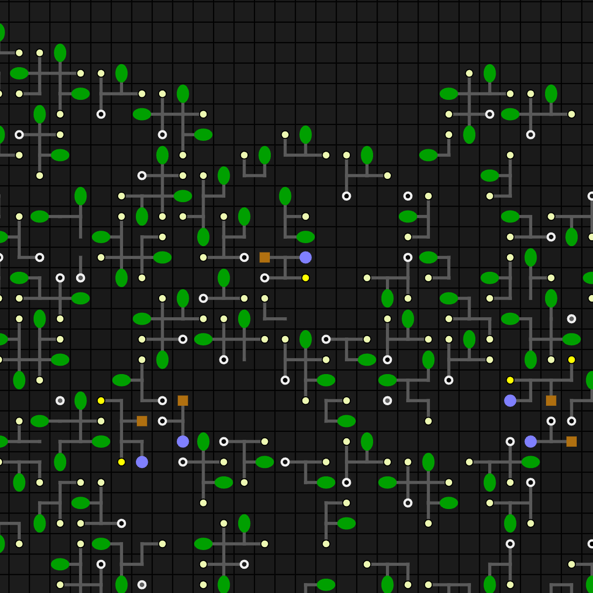
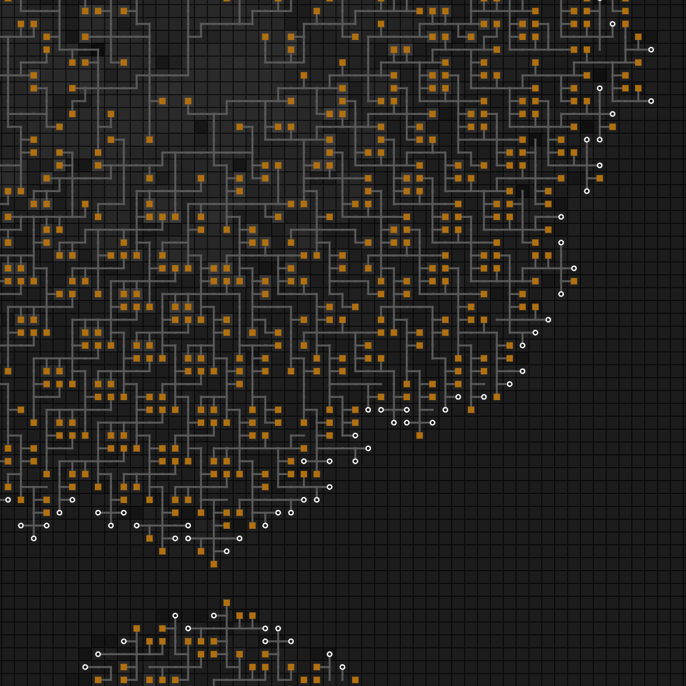

<h1 align="center">🦠 Artifical Life (ALife) 🍀</h1>

**English 🇺🇸 | [Русский](README-RU.md) 🇷🇺**

Artifical evolution made with JavaScript.

Idea is taken from project «The Battle Of Clans» by [Simulife Hub](https://youtube.com/@wallcraft-video).

Version: 1.0.0 (27.02.2024)

[**DEMOVERSION**](https://megospc.github.io/ALife/demo.html?lang=en)\
[**FULL VERSION**](https://megospc.github.io/ALife/index.html?lang=en)

## Screenshots

  
<b>Open me!</b>

  

## Features
+ It works right in a browser: **you don't need to download anything**, just go by [the link](https://megospc.github.io/ALife/index.html?lang=en).
+ You can run worlds up to **1800x1800 tiles** in size.
+ It uses WebGL and it renders on your GPU, so **rendering is faster by about 3 times**.
+ The required memory buffer is allocated when the simulation starts, so JavaScript's garbage cleaner isn't busy. **This speeds up processing by about 2 time**.
+ It works on mobile devices.

## Description
**ALife** is a simulator of evolution of multicellular organisms.

### Operating Principle
The entire field is divided into many squares (a «*Tile*»). Each *tile* contains a some amount of resources: *organic* and *charge*. There may also be a living cell (a «*Cell*») on the tile. Each *cell* has its own supply of energy and spends a little of it every turn. If there is not enough energy, the cell dies. When a cell dies, it leaves some *organic* and *charge* (amount of charge = energy that was in the cell) in a 3x3 *tiles* area. If tile has too much *organic* or *charge*, it becomes *poisoned*. If a cell locates on *poisoning*, it dies. If the *charge* exceeds a certain value, it begins to slowly disappear until it reaches that value.

Cells can be different types:
+ **Leaf**. Each turn gets from the sun. The more *organic* there is in a *tile* under a leaf, the more energy it can get. If two leaves touch, they both stop producing energy.
+ **Root**. Each turn removes a little *organic* (if any) from the tile underneath it and gains energy. Does not die from *organic poisoning*.
+ **Antenna**. Each turn removes a little *charge* (if any) from the tile underneath it and gains energy. Does not die from *energy poisoning*.
+ **Shoot**. Consumes a lot of energy. Each shoot has its own *genome* (the program according to which it operates). By following its instructions, shoot can grow, creating up to three new cells around itself (it itself will turn into a wood), eat any *cell* nearby (except wood), etc. As long as it has not given off branches, it can move around the field and eat organic. Its color depends on the amount of energy, which it has (black - little, white - a lot). If the shoot accumulates a lot of energy, it will fall off the wood to which it is attached and become single-celled.
+ **Wood**. Involved in transporting energy from producing cells to shoots and seeds.
+ **Seed**. A dormant appendage that consumes almost no energy. If the wood, to which it is attached, dies, the seed wakes up and turns into a shoot that will continue to carry out the commands of the *genome*. Sometimes, before turning into a shoot, a seed shoots out and flies through a certain number of *tiles*. If at the same time it encounters another *cell* on its way, this cell and the seed will die. It will also fall off and wake up if it accumulates a certain amount of energy.

*If someting isn't clear enough, please, write about it in Issues.*